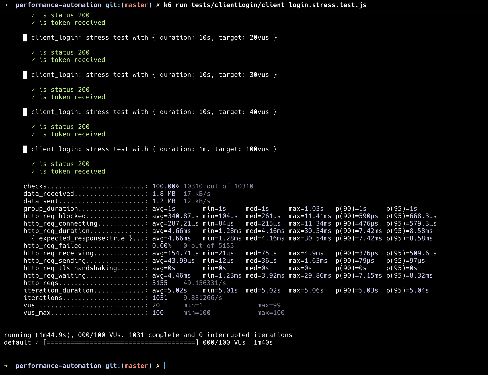

# Performance test automation framework

This project is to automate the performance testing of the APIs

### Teck Stack:

- JavaScript
- K6
- Chai
- K6-html reporter

## Folder structure

- BDD scripts are saved under `tests`
- Test reports are saved under `reports`

### Steps to run tests locally

```shell
npm install
k6 run $scriptpath
ex: k6 run tests/clientRegistration/client_registration.load.test.js
```

### Steps to run tests in CICD

I configured this workflow for manual triggering, as performance testing is generally targeted at specific endpoints. This approach ensures tests can be run individually, focusing on the specific endpoint of interest. Additionally, running multiple performance tests in parallel is avoided to prevent inaccurate results caused by resource contention or overlapping loads.

```shell
Open actions
Select workflow ~ Run k6 Test
Enter the path of the test which you want to run
Trigger the pipeline
```

### Steps to open report

```shell
open $reportName
ex: open reports/client_registration.stress.test.html
```

### Logical and Security bugs

All the issues are saved in the attached google [doc](https://docs.google.com/document/d/1Sy6WBq13eKbtVi1OQ1oxCvsXCeKXo4cYiO6kP2v8_T8/edit?usp=sharing)

Sample Report:


Local Run Report:


Pipeline:

